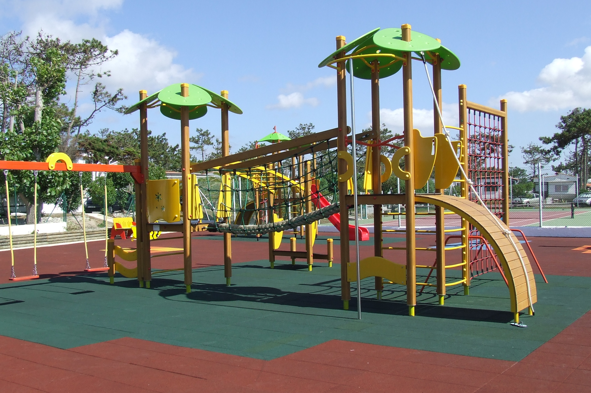
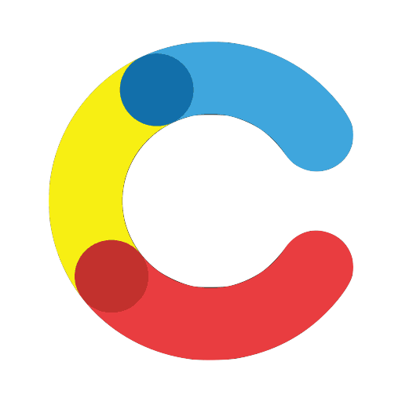
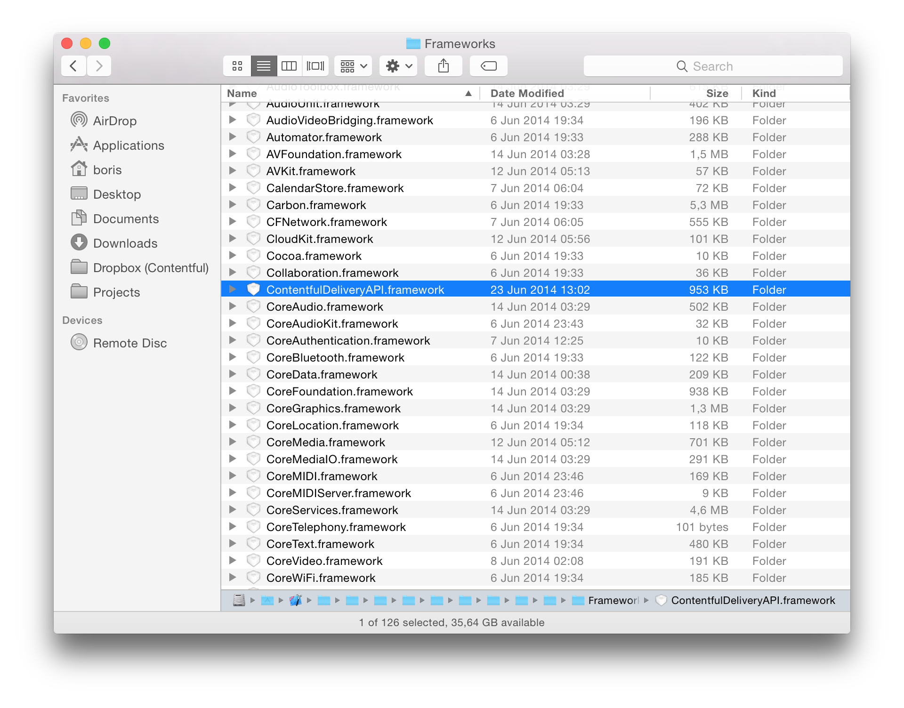
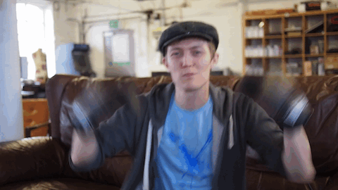
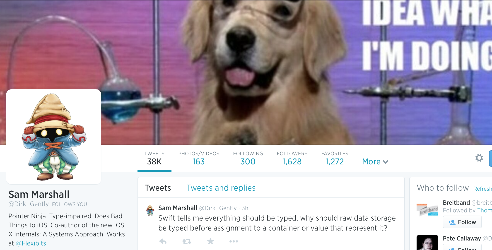
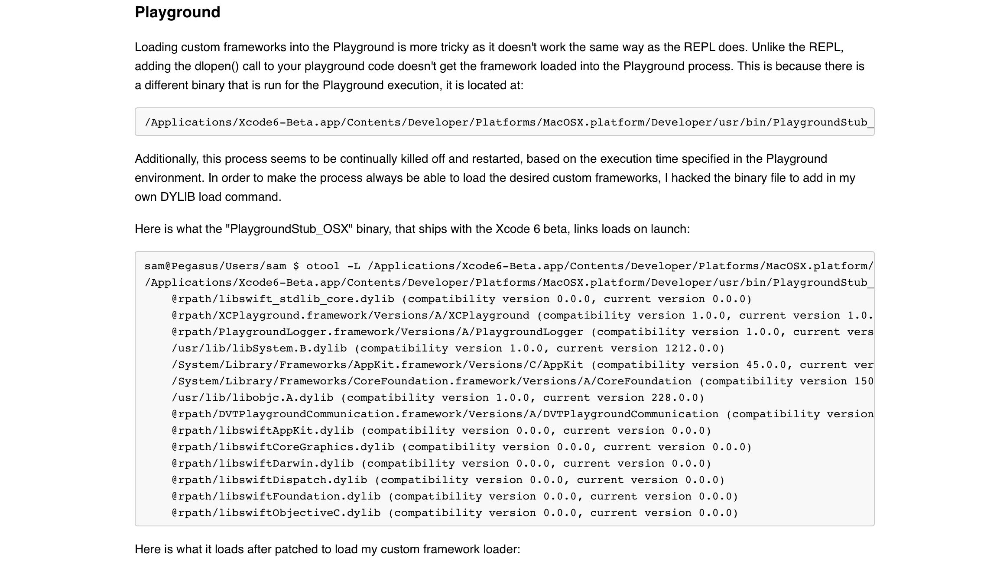
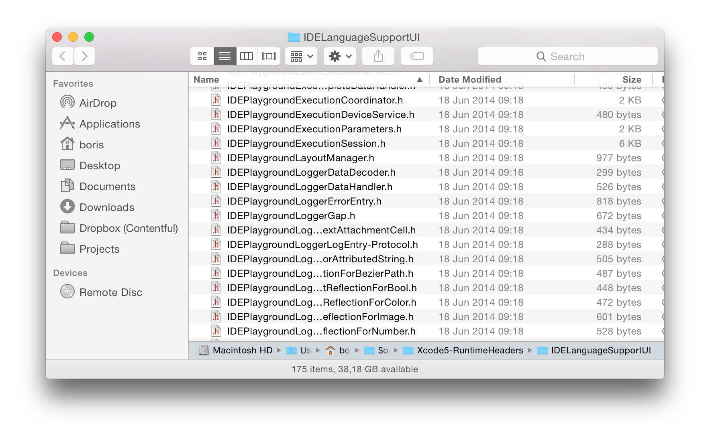
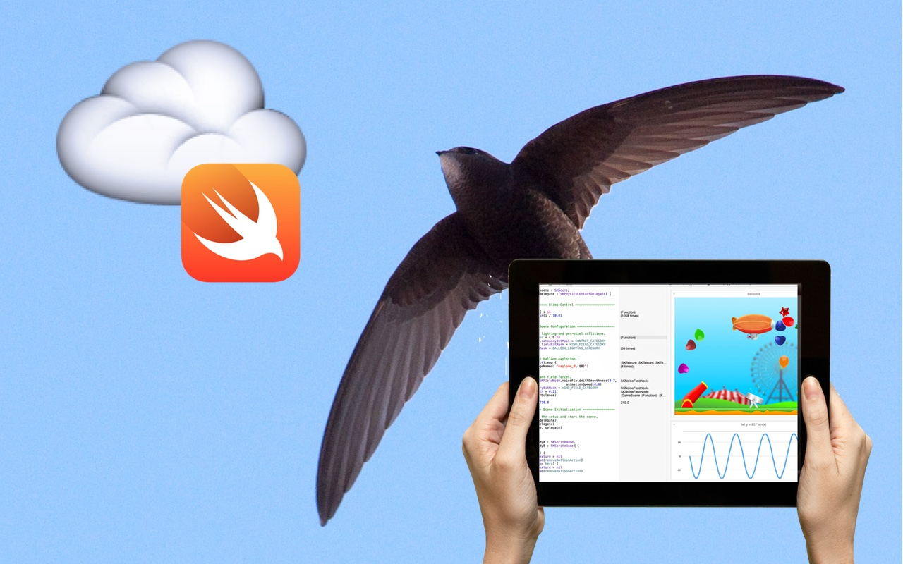
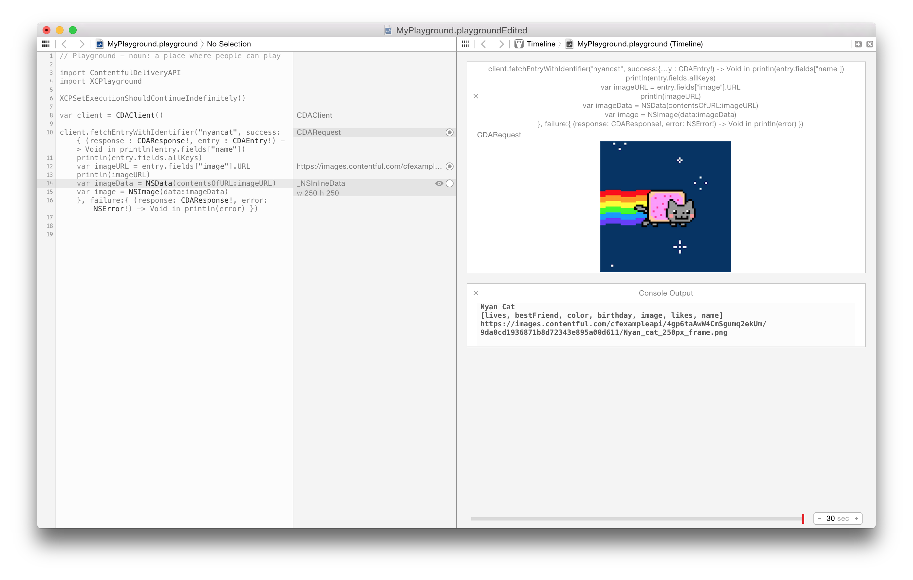
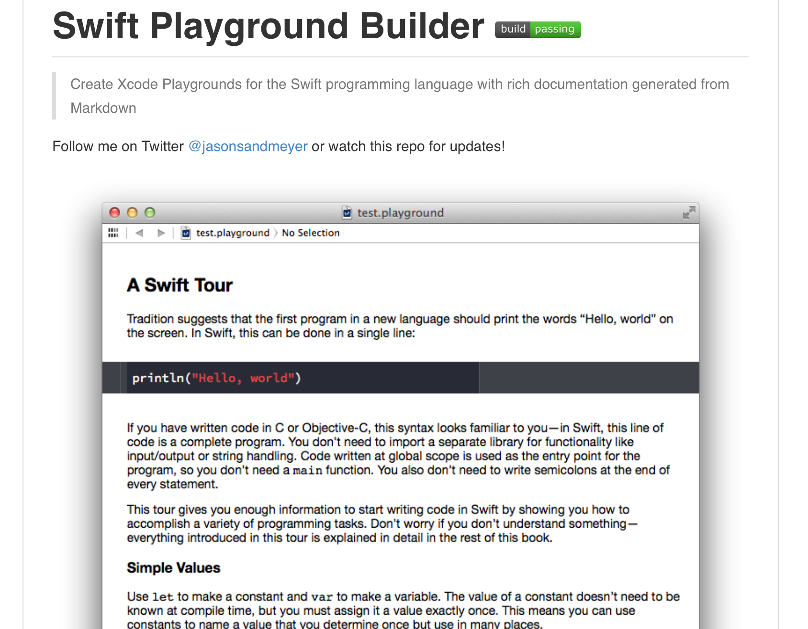

# 💥 Custom Playgrounds 🎯

## swift.berlin #2, July 2014

### Boris Bügling - @NeoNacho

---

---

### CocoaPods

### -

### Contentful

---

# Swift

---

# REPL

---

    $ swift
    Welcome to Swift!  Type :help for assistance.
      1> import ContentfulDeliveryAPI
    <REPL>:1:8: error: no such module 'ContentfulDeliveryAPI'
    import ContentfulDeliveryAPI
           ^

---

Copy your framework over to **/Applications/Xcode6-Beta2.app/Contents/Developer/Platforms/MacOSX.platform/Developer/SDKs/MacOSX10.10.sdk/System/Library/Frameworks**

---

    1> import ContentfulDeliveryAPI
    2> var client = CDAClient()
    client: CDAClient = <extracting data from value failed>

    error: Couldn't lookup symbols:
      _OBJC_CLASS_$_CDAClient

---

### Load the dynamic library from your framework using `dlopen()`

---

    3> var handle = dlopen("/Applications/.../Versions/A/ContentfulDeliveryAPI", 2)
    handle: COpaquePointer = Builtin.RawPointer = 
    0x0000000102e2b6e0 -> 0x00007fff5fc37e50 
    vtable for ImageLoaderMachOCompressed + 16
    4> var client = CDAClient()
    client: CDAClient = {}

---

# Success

---

    // Playground - noun: a place where people can play

---

---

---

    24/06/14 01:00:00,780 Xcode[84816]: 
    IDEPlaygroundExecutionSessionThread(pid=85188) 
    IDEPlaygroundExecution: [PlaygroundSession <0x7fff12750c70>] 
    Received error from expr: error: error: Couldn't lookup symbols:
     _OBJC_CLASS_$_CDAClient

---

---

# Sam Marshall

---

---

# Xcode plugin?

---

---

# DVTPlaygroundCommunication.framework

    @interface DVTPlaygroundCommunicationListener {
        NSString *_socketPath;
    }

    @interface DVTPlaygroundCommunicationSender

- Uses TCP/IP on the local machine to communicate between Stub and Xcode
- But apparently uses Unix domain sockets for the other direction (?)

---

# ¯\\\_(ツ)\_/¯ 

---

---

---

# ➡️ Xcode plugin

---

### libPlaygroundInjector.dylib

---

    #import <IDELanguageSupportUI/IDEPlaygroundExecutionDeviceService.h>

    @interface IDELocalComputerPlaygroundExecutionDeviceService : 
    IDEPlaygroundExecutionDeviceService

    + (id)capability;
    - (id)sessionForExecutingPlaygroundWithParameters:(id)arg1;
    - (id)defaultStubPathForSDK:(id)arg1;

    @end

---

## DYLD\_INSERT\_LIBRARIES

---

    @interface IDEPlaygroundExecutionSession : NSOperation

    [...]

    - (void)cleanupExecutable;
    - (void)destroyDebugger;
    - (void)_stopListeningForPlaygroundInput;
    - (void)_interruptExecutingPlaygroundSource;
    - (void)cancel;
    - (BOOL)canFinishExecution;

    [...]

    @end

---

    @interface IDEPlaygroundExecutionParameters : NSObject

    [...]

    - (id)initWithSourceCodeToExecute:(id)arg1 
                      documentFileURL:(id)arg2
                      documentContentTimestamp:(id)arg3 
                      autoTerminationDelay:(unsigned long long)arg4 
                      executionPreparationParameters:(id)arg5 
                      playgroundReportResultBlock:(id)arg6 
                      playgroundExecutionWillFinishBlock:(void)arg7
                      playgroundExpressionCompleteBlock:(id)arg8 
                      errorHandlerBlock:(void)arg9;

    @end

---

---

# SourceKit

---

    @interface IDESourceLanguageServiceSwift : DVTSourceLanguageService

    [...]

    - (void)_applyChangesFromSourceLanguageServiceContext:(id)arg1;

    [...]

    @end

---

    05/07/14 09:43:08,109 Xcode[9202]: toy-unboxing -- Fixed context: {
        DVTSourceLanguageServiceContextFormatOptionsKey =     { ... };
        DVTSourceLanguageServiceContextTextStorage = ...;
        IDESourceLangaugeServiceContextBuildSettings =     {
            swiftASTCommandArguments =         (
                "-module-name",
                Playground,
                "-target",
                "x86_64-apple-macosx10.10",
                "-sdk",
                "/Applications/Xcode6-Beta2.app/.../MacOSX10.10.sdk",
                "-F",
                "/Applications/Xcode6-Beta2.app/.../Frameworks",
                "-F",
                "/Applications/Xcode6-Beta2.app/.../PrivateFrameworks",
                "-Xfrontend",
                "-debugger-support",
                "-c",
                "/Users/boris/Desktop/MyPlayground.playground"
            );
        };
        IDESourceLanguageServiceContextDocument = ...;
        IDESourceLanguageServiceContextDocumentURL = ...;
    }

---

IDESource**Langauge**ServiceContextBuildSettings

---

IDESourceLang**au**geServiceContextBuildSettings

---

### (╯°□°）╯︵ ┻━┻

---

    [...]

    "-F",
    "/Users/boris/Library/Developer/Playground Frameworks",

    [...]

---

---

    import XCPlayground

    XCPSetExecutionShouldContinueIndefinitely()

---

---

# Demo

---

---

# Relevant WWDC 2014 sessions

- Session 408: Swift Playgrounds
- Session 409: Introduction to LLDB and the Swift REPL

---

# Links

- <http://samdmarshall.com/blog/custom_frameworks_and_swift.html>
- <https://github.com/jas/swift-playground-builder>
- <http://stackoverflow.com/questions/24058336/how-do-i-run-asynchronous-callbacks-in-playground>

---

# Thank you!

---

### <http://vu0.org/playgrounds>
### <http://vu0.org/alt14>
### @NeoNacho

---

### It's a zero!

